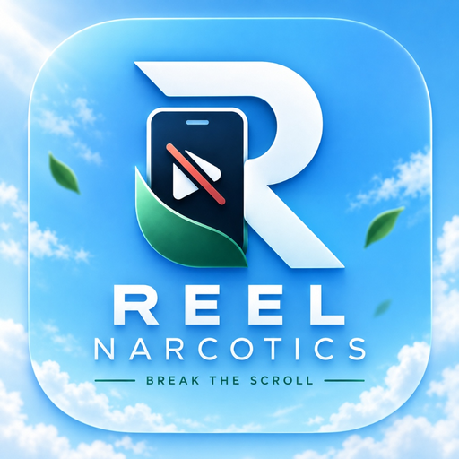
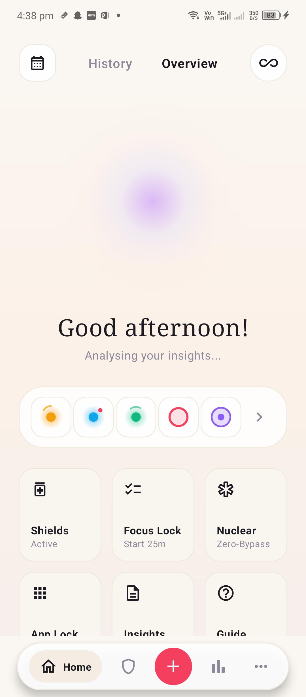
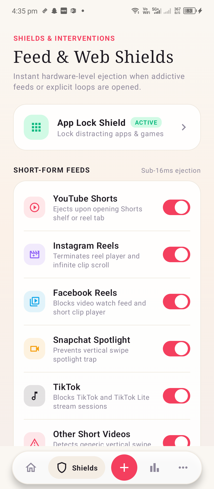
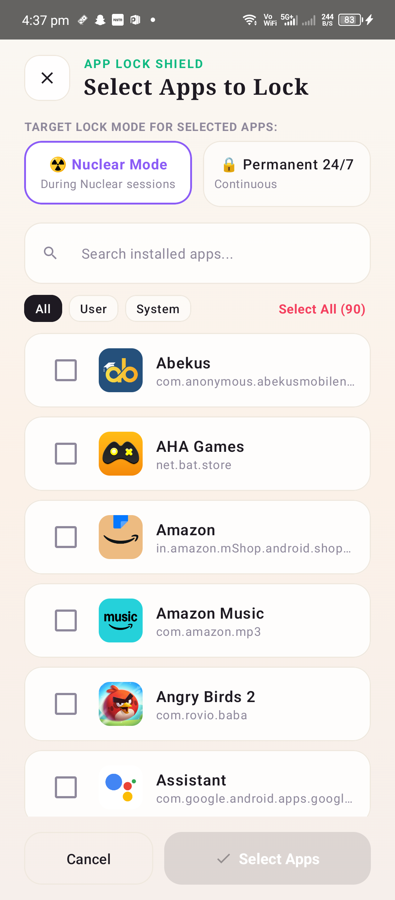
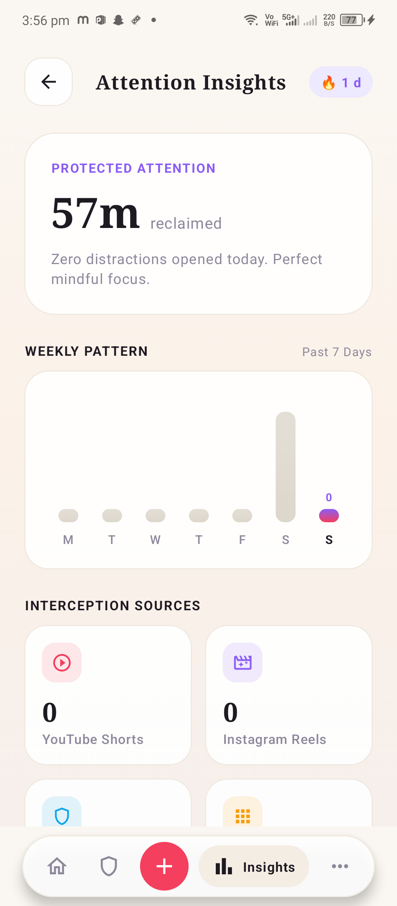
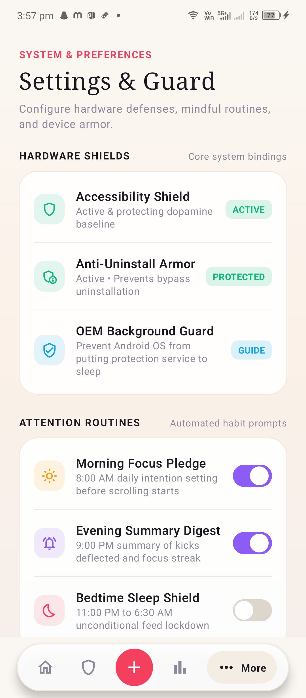

# <p align="center"></p>

<h1 align="center">REEL NARCOTICS ⚡</h1>

<p align="center">
  <strong>Surgical distraction blocker for Android engineered to destroy short-form dopamine loops.</strong><br>
  <em>100% Offline • Zero Telemetry • Absolute-Timestamp Focus Locks • Multi-OEM Certified</em>
</p>

<p align="center">
  <a href="https://reel-narcotics.vercel.app/"></a>
  <a href="https://reel-narcotics.vercel.app/assets/ReelNarcotics-v2.5.0-Release.apk"></a>
  
  
</p>

---

## 📱 Visual Showcase (v2.5.0 Production Build)

Captured live on device running Android 13 with active Focus Lock:

| 1. Focus Command Center | 2. Content Shields | 3. App Lock Armor | 4. Attention Insights | 5. Settings & Guard |
| :---: | :---: | :---: | :---: | :---: |
|  |  |  |  |  |
| **Active Lock & Timer**<br>Live session countdown, real-time status badge & one-tap challenges. | **Surgical Enforcement**<br>Granular platform toggles: Shorts, Reels, Spotlight, Adult Web. | **App Lock Armor**<br>Permanent 24/7 or Nuclear Session app locking with 0ms ejection. | **Attention Insights**<br>Reclaimed minutes, weekly pattern graphs & deflection ledger. | **Daily Habit Engine**<br>Morning Focus Pledge, Evening Victory Digest & Night theme. |

---

## 🚀 Why Reel Narcotics?

Modern social platforms intentionally deploy variable reward loops and infinite vertical swipe mechanics to hijack human attention. When you use traditional blockers that ban entire apps (like YouTube or Instagram), you lose important work tutorials, university lectures, and family messages. Users inevitably disable those blunt blockers and relapse.

**Reel Narcotics takes a surgical approach**:
- **YouTube**: Blocks Shorts viewer, shelves, and tabs while preserving full access to long tutorials, documentaries, searches, and playlists.
- **Instagram**: Blocks Reels viewer, audio pages, and bottom tabs while preserving direct messages (DMs), user profiles, and feed photos.
- **Snapchat**: Blocks Spotlight vertical video feeds and infinite stories while keeping camera capture and chats accessible.
- **Facebook**: Blocks Facebook Reels while keeping groups, marketplace, and feeds accessible.
- **Adult & Explicit Web Shield**: Local domain blocklist (500+ domains) with real-time address bar analysis across 14 major Android browsers (Chrome, Firefox, Brave, Edge, Opera, Samsung Internet, DuckDuckGo, etc.).

---

## 🛡️ Multi-OEM Compatibility & Safety Certification (v2.4.2)

Reel Narcotics has been engineered and certified to run cleanly without battery suspension or false positives across all major smartphone manufacturers:

| Manufacturer | Custom OS | Engineering Solution Applied |
| :--- | :--- | :--- |
| **Xiaomi / POCO / Redmi** | MIUI / HyperOS | Direct `openMIUIAutostart()` intent, 10s countdown walkthrough, whitelisted MIUI calculator and contacts |
| **Samsung** | One UI | Deep link to `InstalledAccessibilityServicesSettings`, One UI battery unrestrict flow, whitelisted clock & popup calculator |
| **Vivo / iQOO** | Funtouch / OriginOS | Intent triggers for `PurviewTabActivity` & `ExcessivePowerManagerActivity`, whitelisted BBKClock |
| **Oppo / Realme / OnePlus** | ColorOS / OxygenOS | Direct link to Startup Manager, whitelisted OnePlus/ColorOS dialers and alarm clocks |
| **Infinix / Tecno / itel** | XOS / HiOS | Custom XOS flow (no phantom 3-dots), Phone Master autostart trigger, whitelisted Transsion dialer & tools |
| **Google Pixel / Motorola** | Stock AOSP | Standard AOSP permission flows, native 3-dots unfreeze guide, battery optimization exemption |

### ⚡ Universal 0ms Wildcard Immunity
Emergency calls, alarms, and productivity tools are safeguarded at the root accessibility layer:
```kotlin
fun isEssentialUtility(pkg: String): Boolean {
    return pkg.contains("dialer") || pkg.contains("incallui") || pkg.contains("telecom") ||
           pkg.contains("calculator") || pkg.contains("deskclock") || pkg.contains("clockpackage") ||
           pkg.contains("bbkclock") || pkg.contains("camera") || pkg.contains("gallery") ||
           pkg.contains("alarmclock") || pkg.contains("emergency")
}
```
If an event originates from any dialer or essential tool, Reel Narcotics exits in **0ms** without evaluating any blocking rule.

---

## 🔒 100% Offline • Zero Telemetry Guarantee

- **Zero Network Traffic**: All detection, heuristic analysis, and blocking logic execute strictly on-device.
- **Zero Cloud Services**: No Firebase, no AWS, no Supabase, no third-party analytics, and zero advertising SDKs.
- **Local Relational Database**: All statistics, streak counters, and block events are stored in a local SQLite database (`zenith_focus.db`).

---

## 🔔 Daily Habit Loop & Bedtime Sleep Shield

- **🌅 Morning Focus Pledge (8:00 AM)**: Daily morning intention alert before scrolling starts.
- **🔥 Evening Victory Digest (9:00 PM)**: Summary celebrating total distractions blocked, minutes saved, and active focus streak.
- **🌙 Bedtime Sleep Shield (11:00 PM – 6:30 AM)**: Automatic overnight feed barrier.
- **Android 13+ Notification Shield**: Full `POST_NOTIFICATIONS` runtime declaration ensures alerts are never silently dropped by modern Android systems.

---

## 🛠️ Build & Installation

### Build Signed Release APK
```bash
./gradlew assembleRelease --no-daemon
```
The output APK will be generated at:
`app/build/outputs/apk/release/app-release.apk`

### Install via ADB
```bash
adb install -r -d -g app/build/outputs/apk/release/app-release.apk
```

---

## 📄 License & Disclaimer

Released under the [Apache 2.0 License](LICENSE).  
Reel Narcotics is designed for personal digital wellbeing and discipline enhancement. All platform names and trademarks belong to their respective owners.
